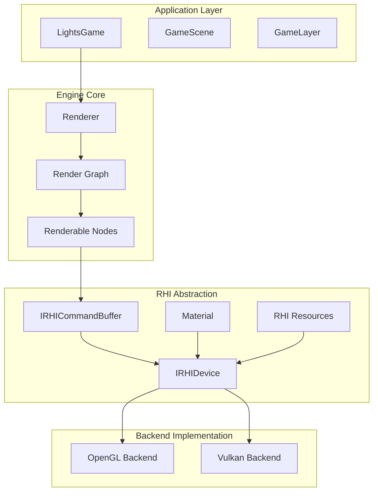
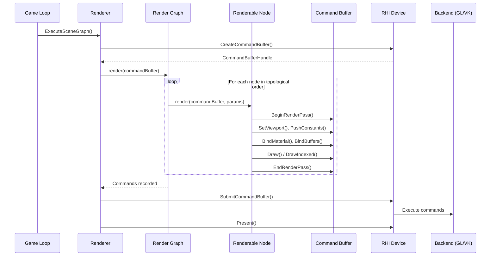
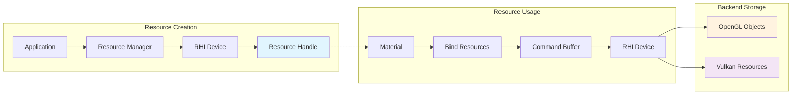

# Vulkan RHI Implementation Plan

## Problem Statement

The lights engine currently has direct OpenGL integration throughout the codebase. To add Vulkan support, we need to
create a modern RHI (Render Hardware Interface) abstraction that:

- Supports both OpenGL and Vulkan backends with runtime switching
- Modernizes the rendering API to be less OpenGL-specific
- Integrates cleanly with the existing render graph (Renderable) system
- Uses an RHIDevice pattern for resource management

## Proposed Architecture

### RHIDevice-Centric Design

- **RHIDevice**: Central coordinator that owns resources and command submission
- **Resource Management**: Device creates and manages shaders, textures, buffers
- **Command Buffers**: Single command buffer per frame, passed through render graph
- **Backend Abstraction**: OpenGL and Vulkan implementations behind common interface
- **Ownership**: `LightsGame` owns both `RHIDevice` and `ResourceManager`; `ResourceManager` depends on `RHIDevice`, not the other way around

### Key Design Principles

1. **Modern API**: Command-buffer based, less immediate-mode
2. **Resource Ownership**: RHIDevice owns all GPU resources
3. **Render Graph Integration**: Command buffer flows through existing Renderable::render() calls
4. **Runtime Backend Selection**: Choose OpenGL/Vulkan at application startup
5. **Future-Proof**: Architecture supports later parallelization of command recording

## Platform Bootstrap & Initialization

Renderer initialization is tightly coupled to platform initialization — the window must exist before the graphics backend can create a surface or context. The correct sequence is: **platform → device → renderer → resource manager → scene**.

### Initialization Sequence

```
1. Window/Platform  →  native window handle, required instance extensions
2. RHIDevice        →  instance, surface, physical device, logical device, swapchain, queues
3. Renderer         →  owns frame lifecycle (BeginFrame/EndFrame) via device
4. ResourceManager  →  GPU uploads via device
5. Scene/Game       →  loads resources via ResourceManager
```

### PlatformContext & Device Creation

```cpp
// Provided by the platform layer (Window) to bootstrap the device
struct PlatformContext {
    void* nativeWindowHandle;                          // HWND, xcb_window_t, etc.
    void* nativeDisplayHandle;                         // DISPLAY, xcb_connection_t, etc.
    std::vector<const char*> requiredInstanceExtensions; // from glfwGetRequiredInstanceExtensions
    glm::ivec2 windowSize;
};

struct RHIDeviceDesc {
    RHIBackendType backend       = RHIBackendType::Auto;
    PlatformContext platform;
    bool enableValidation        = false;
};

// Device factory - selects backend, runs full backend init internally
std::unique_ptr<IRHIDevice> CreateRHIDevice(const RHIDeviceDesc& desc);
```

### LightsGame Initialization Order

```cpp
bool LightsGame::Initialize(const GameParameters& params) {
    // 1. Platform first — window and native handles must exist before device
    m_window = CreatePlatformWindow(params);

    // 2. Device — runs all backend init (vkCreateInstance, surface, swapchain, queues, etc.)
    m_rhiDevice = CreateRHIDevice({
        .backend          = params.PreferredBackend,
        .platform         = m_window->GetPlatformContext(),
        .enableValidation = params.EnableValidation,
    });

    // 3. Renderer — only consumer of BeginFrame/EndFrame
    m_renderer = std::make_unique<Renderer>(m_rhiDevice.get());

    // 4. ResourceManager — depends on device for GPU resource creation/upload
    m_resourceManager = std::make_unique<ResourceManager>(m_rhiDevice.get());

    // 5. Scene — loads assets via ResourceManager
    m_scene = std::make_unique<SceneType>();
    m_scene->Init(m_resourceManager.get());

    return true;
}

// Window resize stays entirely inside the device — callers just notify
void LightsGame::OnWindowResize(glm::ivec2 newSize) {
    m_rhiDevice->NotifyWindowResize(newSize);
    // Renderer picks up the new swapchain automatically on next BeginFrame
}
```

## Implementation Workplan

### Phase 1: Core RHI Foundation

- [ ] Design and implement core RHI interfaces (IRHIDevice, IRHICommandBuffer, IRHIResource)
- [ ] Create RHIDevice factory system with OpenGL/Vulkan backend selection
- [ ] Implement basic OpenGL RHIDevice to validate interface design
- [ ] Design resource handle system (RHITexture, RHIShader, RHIBuffer abstractions)
- [ ] Create command buffer abstraction for draw commands and state changes

### Phase 2: Resource Management Abstraction

- [ ] Abstract texture creation and management through RHIDevice
- [ ] Abstract shader compilation and management through RHIDevice
- [ ] Abstract buffer (vertex/index/uniform) creation and management
- [ ] Implement resource tracking and lifetime management
- [ ] Add render target/framebuffer abstraction

### Phase 3: Command Recording System

- [ ] Design command buffer API for common operations (draw, clear, set state)
- [ ] Integrate command buffer into existing Renderable::render() signature
- [ ] Implement immediate-mode emulation for OpenGL backend
- [ ] Add render pass concept for Vulkan-style rendering
- [ ] Implement basic state tracking and validation

### Phase 4: Engine Integration

- [ ] Refactor existing Material class to use RHI abstractions
- [ ] Update Renderer class to create and submit command buffers
- [ ] Modify resource loading to go through RHIDevice
- [ ] Update scene rendering pipeline to use new command flow
- [ ] Ensure backward compatibility layer if needed for truck-kun app

### Phase 5: Vulkan Backend Implementation

- [ ] Implement Vulkan instance and device creation
- [ ] Create Vulkan RHIDevice implementation
- [ ] Implement Vulkan resource management (textures, buffers, shaders)
- [ ] Add Vulkan command buffer recording and submission
- [ ] Implement Vulkan render passes and synchronization
- [ ] Add Vulkan-specific optimizations (descriptor sets, memory management)

### Phase 6: Testing and Polish

- [ ] Create comprehensive test suite for RHI interface
- [ ] Test OpenGL and Vulkan backends with truck-kun application
- [ ] Add runtime backend switching mechanism
- [ ] Performance testing and optimization
- [ ] Documentation and code cleanup

## Interface Design Examples

### Core RHI Interfaces

```cpp
// Base RHI Device Interface
class IRHIDevice {
public:
    virtual ~IRHIDevice() = default;

    // Frame lifecycle — swapchain acquisition, sync, and present are fully internal
    virtual FrameContext BeginFrame() = 0;
    virtual void EndFrame(FrameContext frame) = 0;

    // Resource Creation
    virtual RHITextureHandle      CreateTexture(const TextureDesc& desc) = 0;
    virtual RHIShaderHandle       CreateShader(const ShaderDesc& desc) = 0;
    virtual RHIBufferHandle       CreateBuffer(const BufferDesc& desc) = 0;
    virtual RHIRenderTargetHandle CreateRenderTarget(const RenderTargetDesc& desc) = 0;

    // Resource Updates
    virtual void UpdateBuffer(RHIBufferHandle buffer, const void* data, size_t size, size_t offset = 0) = 0;
    virtual void UpdateTexture(RHITextureHandle texture, const void* data, const TextureUpdateDesc& desc) = 0;

    // Resource Destruction
    virtual void DestroyTexture(RHITextureHandle handle) = 0;
    virtual void DestroyShader(RHIShaderHandle handle) = 0;
    virtual void DestroyBuffer(RHIBufferHandle handle) = 0;
    virtual void DestroyRenderTarget(RHIRenderTargetHandle handle) = 0;

    // Platform events
    virtual void NotifyWindowResize(glm::ivec2 newSize) = 0;

    // Device Info
    virtual RHIBackendType GetBackendType() const = 0;
    virtual const RHIDeviceCapabilities& GetCapabilities() const = 0;
};

// Command Buffer Interface
class IRHICommandBuffer {
public:
    virtual ~IRHICommandBuffer() = default;
    
    // Render Passes
    virtual void BeginRenderPass(RHIRenderTargetHandle target, const ClearValues& clear) = 0;
    virtual void EndRenderPass() = 0;
    
    // Drawing
    virtual void Draw(uint32_t vertexCount, uint32_t instanceCount = 1, uint32_t firstVertex = 0, uint32_t firstInstance = 0) = 0;
    virtual void DrawIndexed(uint32_t indexCount, uint32_t instanceCount = 1, uint32_t firstIndex = 0, uint32_t firstVertex = 0, uint32_t firstInstance = 0) = 0;
    
    // Resource Binding
    virtual void BindMaterial(RHIMaterialHandle material) = 0;
    virtual void BindVertexBuffer(RHIBufferHandle buffer, uint32_t binding = 0, uint64_t offset = 0) = 0;
    virtual void BindIndexBuffer(RHIBufferHandle buffer, RHIIndexType indexType, uint64_t offset = 0) = 0;
    
    // State Management
    virtual void SetViewport(const Viewport& viewport) = 0;
    virtual void SetScissor(const ScissorRect& scissor) = 0;
    
    // Uniforms/Push Constants
    virtual void PushConstants(const void* data, uint32_t size, uint32_t offset = 0) = 0;
    virtual void BindUniformBuffer(RHIBufferHandle buffer, uint32_t binding) = 0;
    
    // Debug
    virtual void BeginDebugMarker(const char* name) = 0;
    virtual void EndDebugMarker() = 0;
};

// Resource Handle System (type-safe opaque handles)
template<typename T>
struct RHIHandle {
    uint32_t id = INVALID_HANDLE;
    uint32_t generation = 0;
    
    bool IsValid() const { return id != INVALID_HANDLE; }
    operator bool() const { return IsValid(); }
    
    bool operator==(const RHIHandle& other) const {
        return id == other.id && generation == other.generation;
    }
    bool operator!=(const RHIHandle& other) const { return !(*this == other); }
};

using RHITextureHandle = RHIHandle<struct RHITexture>;
using RHIShaderHandle = RHIHandle<struct RHIShader>;
using RHIBufferHandle = RHIHandle<struct RHIBuffer>;
using RHIMaterialHandle = RHIHandle<struct RHIMaterial>;
using RHIRenderTargetHandle = RHIHandle<struct RHIRenderTarget>;
using RHICommandBufferHandle = RHIHandle<struct RHICommandBuffer>;

// Modern Material Interface
class Material {
private:
    RHIMaterialHandle m_handle;
    IRHIDevice* m_device;
    
public:
    Material(IRHIDevice* device, RHIShaderHandle shader);
    
    // Resource binding - accumulated until BindToCommandBuffer
    void SetTexture(const std::string& name, RHITextureHandle texture);
    void SetUniformBuffer(const std::string& name, RHIBufferHandle buffer);
    void SetPushConstant(const std::string& name, const void* data, size_t size);
    
    // Command buffer integration
    void BindToCommandBuffer(IRHICommandBuffer* cmdBuffer);
    
    RHIMaterialHandle GetHandle() const { return m_handle; }
};
```

### Updated Renderable Interface

```cpp
// Updated base Renderable class
class Renderable : public GraphNode {
public:
    // New signature: receives command buffer for recording
    virtual void render(IRHICommandBuffer* commandBuffer, const RenderParams& params) = 0;
    
    // Legacy compatibility (temporary)
    virtual void render() { /* fallback to old path */ }
};

// Example: Updated GameLayer rendering
class GameLayer : public SceneLayer {
public:
    void render(IRHICommandBuffer* commandBuffer, const RenderParams& params) override {
        // Begin render pass to our render target
        commandBuffer->BeginRenderPass(m_mainRenderTarget, {.color = glm::vec4(0.1f, 0.1f, 0.1f, 1.0f)});
        
        // Set viewport and camera uniforms
        commandBuffer->SetViewport(m_viewport);
        commandBuffer->PushConstants(&params.viewProjection, sizeof(glm::mat4));
        
        // Render all entities through ECS
        RenderEntities(commandBuffer, params);
        
        commandBuffer->EndRenderPass();
    }
    
private:
    void RenderEntities(IRHICommandBuffer* cmdBuffer, const RenderParams& params) {
        auto view = m_registry.view<WorldTransformCacheComponent, RenderComponent>();
        
        for (auto entity : view) {
            auto& transform = view.get<WorldTransformCacheComponent>(entity);
            auto& render = view.get<RenderComponent>(entity);
            
            // Modern material binding
            render.Material->SetPushConstant("model", &transform.WorldTransform, sizeof(glm::mat4));
            render.Material->BindToCommandBuffer(cmdBuffer);
            
            // Bind mesh and draw
            cmdBuffer->BindVertexBuffer(render.Mesh->GetVertexBuffer());
            cmdBuffer->BindIndexBuffer(render.Mesh->GetIndexBuffer(), RHIIndexType::UInt16);
            cmdBuffer->DrawIndexed(render.Mesh->GetIndexCount());
        }
    }
};
```

## Architecture Diagrams

### Overall RHI Architecture



### Command Buffer Flow



### Resource Management Flow



## Generational Handle System Deep Dive

The "generational" aspect is the key innovation that makes handles safe and prevents common resource management bugs. Here's how it works:

### The Core Problem: Slot Reuse
Without generations, handles are just indices into an array:
```cpp
// BAD: Simple index-based handles
struct SimpleHandle { uint32_t id; };

std::vector<Texture> textures;
std::queue<uint32_t> freeSlots;

SimpleHandle CreateTexture() {
    if (!freeSlots.empty()) {
        uint32_t slot = freeSlots.front();
        freeSlots.pop();
        return SimpleHandle{slot};  // Reuse old slot
    }
    // ... allocate new slot
}
```

**The Problem:** What happens when you reuse a slot?
```cpp
auto handleA = CreateTexture();     // Gets slot 5 → {id: 5}
DestroyTexture(handleA);            // Frees slot 5, adds to free list

auto handleB = CreateTexture();     // Reuses slot 5 → {id: 5}

// BUG: handleA and handleB are identical!
// Old code can still access the new texture through handleA
```

### The Solution: Generation Counter
Add a generation counter that increments each time a slot is reused:

```cpp
struct ResourceSlot {
    Texture texture;
    uint32_t generation;    // This is the key!
    bool isAlive;
};

std::vector<ResourceSlot> slots;

RHIHandle CreateTexture() {
    uint32_t slotIndex;
    if (!freeSlots.empty()) {
        slotIndex = freeSlots.front();
        freeSlots.pop();
        
        // CRITICAL: Increment generation when reusing slot
        slots[slotIndex].generation++;
    } else {
        slotIndex = slots.size();
        slots.emplace_back();
        slots[slotIndex].generation = 1;  // Start at 1
    }
    
    slots[slotIndex].isAlive = true;
    
    return RHIHandle{
        .id = slotIndex,
        .generation = slots[slotIndex].generation  // Store current generation
    };
}
```

### Step-by-Step Example

**Step 1: Create first texture**
```cpp
auto handleA = CreateTexture();  // Returns {id: 5, generation: 1}

// Slot array state:
// slots[5] = {texture: TextureA, generation: 1, isAlive: true}
```

**Step 2: Destroy texture**
```cpp
DestroyTexture(handleA);

// Slot array state:
// slots[5] = {texture: <destroyed>, generation: 1, isAlive: false}
// freeSlots.push(5)  // Slot 5 is now available for reuse
```

**Step 3: Create second texture (reuses slot)**
```cpp
auto handleB = CreateTexture();  // Returns {id: 5, generation: 2}

// Slot array state:
// slots[5] = {texture: TextureB, generation: 2, isAlive: true}
//                                         ↑
//                                   GENERATION INCREMENTED!
```

**Step 4: Try to use old handle**
```cpp
// Someone still has the old handleA = {id: 5, generation: 1}
Texture* tex = GetTexture(handleA);

bool IsValidHandle(RHIHandle handle) {
    if (handle.id >= slots.size()) return false;           // ✓ Valid index
    if (!slots[handle.id].isAlive) return false;          // ✓ Slot is alive
    if (slots[handle.id].generation != handle.generation)  // ❌ GENERATION MISMATCH!
        return false;                                      //   1 ≠ 2
    return true;
}

// Result: GetTexture(handleA) returns nullptr
// The old handle is safely invalidated!
```

### Why This Prevents Bugs

**1. Use-After-Free Prevention**
```cpp
auto texture = CreateTexture();
DestroyTexture(texture);

// Later, accidentally use destroyed handle
BindTexture(texture);  // Safe! Returns error instead of corrupting memory
```

**2. ABA Problem Prevention**
The ABA problem occurs when:
- Thread A reads value A
- Thread B changes A to B, then back to A  
- Thread A thinks nothing changed

With generations:
```cpp
// Thread A gets handle
auto handleA = CreateTexture();  // {id: 5, gen: 3}

// Thread B destroys and recreates
DestroyTexture(handleA);
auto handleB = CreateTexture();  // {id: 5, gen: 4} - Different generation!

// Thread A's handle is now safely invalid
UseTexture(handleA);  // Returns error, doesn't use wrong texture
```

**3. Debug Safety**
```cpp
// Easy to detect stale handle usage in debug builds
bool IsValidHandle(RHIHandle handle) {
    bool valid = (handle.id < slots.size() && 
                  slots[handle.id].isAlive && 
                  slots[handle.id].generation == handle.generation);
    
    if (!valid && handle.generation != 0) {
        // This was a real handle that became stale
        LOG_WARNING("Using stale handle {id: {}, gen: {}}, current gen: {}", 
                   handle.id, handle.generation, slots[handle.id].generation);
    }
    
    return valid;
}
```

### Memory Layout Optimization

**Packed Representation (32-bit handle):**
```cpp
struct RHIHandle {
    union {
        struct {
            uint32_t id : 24;          // 16M resources max
            uint32_t generation : 8;   // 256 generations max
        };
        uint32_t packed;               // For easy copying/comparison
    };
};
```

**Benefits:**
- Handle fits in 32 bits (same as a pointer on 32-bit systems)
- Cheap to copy (single integer)
- Fast comparison (single integer comparison)
- Cache-friendly when stored in arrays

### Generation Overflow Handling

What happens when generation counter overflows?
```cpp
constexpr uint32_t MAX_GENERATION = 255;  // 8-bit counter

uint32_t AllocateSlot() {
    uint32_t slot = GetFreeSlot();
    
    // Handle overflow
    if (slots[slot].generation >= MAX_GENERATION) {
        // Option 1: Never reuse this slot again
        slots[slot].generation = MAX_GENERATION;
        // Mark slot as permanently retired
        
        // Option 2: Reset and log warning
        slots[slot].generation = 1;
        LOG_WARNING("Generation counter overflow for slot {}", slot);
    } else {
        slots[slot].generation++;
    }
    
    return slot;
}
```

### Real-World Comparison

**Similar systems:**
- **Entity Component Systems**: Entity handles work exactly the same way
- **Vulkan**: VkObjectType handles are similar (but less safe)
- **DirectX 12**: Resource descriptors use generational handles
- **Game Engines**: Unity's InstanceID, Unreal's UObject handles

**Traditional alternative:**
```cpp
// Old way: Raw pointers (unsafe)
Texture* CreateTexture();  // Returns pointer that can become dangling

// New way: Generational handles (safe)
RHITextureHandle CreateTexture();  // Returns handle that validates on access
```

The generational system trades a small amount of memory (extra generation counter) and CPU time (generation check) for significant safety gains and easier debugging.

## Technical Considerations

### Backend-Specific Challenges

**OpenGL:**

- Immediate mode emulation over command buffer abstraction
- Context management and state tracking
- Resource sharing between contexts

**Vulkan:**

- Complex initialization (instance, device, queues, swapchain)
- Explicit memory management
- Synchronization and command buffer lifecycle
- Descriptor set management for resources

### Integration Points

#### 1. Renderer Class

```cpp
class Renderer {
private:
    IRHIDevice* m_rhiDevice;

public:
    explicit Renderer(IRHIDevice* rhiDevice) : m_rhiDevice(rhiDevice) {}

    void ExecuteSceneGraph() {
        // BeginFrame: fence wait, swapchain acquire, command buffer begin — all internal
        FrameContext frame = m_rhiDevice->BeginFrame();

        RenderParams params {
            .commandBuffer = frame.GetCommandBuffer(),
            .backbuffer    = frame.GetBackbuffer(),
        };

        if (auto sceneGraph = GetCurrentScene()->GetSceneGraph()) {
            sceneGraph->render(params);
        }

        // EndFrame: command buffer end, queue submit, present — all internal
        m_rhiDevice->EndFrame(std::move(frame));
    }
};
```

#### 2. Resource Manager Integration

```cpp
class ResourceManager {
private:
    IRHIDevice* m_rhiDevice;

public:
    explicit ResourceManager(IRHIDevice* rhiDevice) : m_rhiDevice(rhiDevice) {}

    RHITextureHandle LoadTexture(const std::string& path) {
        auto imageData = LoadImageFromFile(path);

        TextureDesc desc {
            .width  = imageData.width,
            .height = imageData.height,
            .format = RHIFormat::RGBA8,
            .usage  = RHITextureUsage::ShaderRead,
            .data   = imageData.pixels
        };

        return m_rhiDevice->CreateTexture(desc);
    }

    RHIShaderHandle LoadShader(const std::string& vertPath, const std::string& fragPath) {
        ShaderDesc desc {
            .stages = {
                {RHIShaderStage::Vertex,   ReadFile(vertPath)},
                {RHIShaderStage::Fragment, ReadFile(fragPath)}
            }
        };

        return m_rhiDevice->CreateShader(desc);
    }
};
```

#### 3. Updated Material System

```cpp
class Material {
private:
    IRHIDevice* m_rhiDevice;
    RHIShaderHandle m_shader;

    std::unordered_map<std::string, RHITextureHandle> m_textures;
    std::unordered_map<std::string, RHIBufferHandle>  m_uniformBuffers;
    std::vector<uint8_t> m_pushConstantData;

public:
    Material(IRHIDevice* device, RHIShaderHandle shader)
        : m_rhiDevice(device), m_shader(shader) {}

    void SetTexture(const std::string& name, RHITextureHandle texture) {
        m_textures[name] = texture;
    }

    void SetPushConstant(const std::string& name, const void* data, size_t size) {
        // Accumulate push constant data (layout resolved via shader reflection)
    }

    void BindToCommandBuffer(IRHICommandBuffer* cmdBuffer) {
        auto materialHandle = m_rhiDevice->GetOrCreateMaterialState(m_shader, m_textures, m_uniformBuffers);
        cmdBuffer->BindMaterial(materialHandle);

        if (!m_pushConstantData.empty()) {
            cmdBuffer->PushConstants(m_pushConstantData.data(), m_pushConstantData.size());
        }
    }
};
```

## Frame Lifecycle & Backbuffer Access

Swapchain acquisition happens inside `BeginFrame()`, which returns a `FrameContext` token. App/renderer code never sees raw swapchain images or image indices — only opaque handles and command buffers.

`FrameContext` is only constructable by `RHIDevice` (via `friend`), and its internal swapchain fields are private. The renderer is the sole caller of `BeginFrame`/`EndFrame`; renderables only ever see `RenderParams`.

```cpp
// ------------------------------------------------------------------
// Public-facing frame token - app/renderer code only sees this
// ------------------------------------------------------------------
class FrameContext {
public:
    // Only thing app-level renderables can do:
    IRHICommandBuffer* GetCommandBuffer() { return m_cmdBuffer; }
    RHIRenderTargetHandle GetBackbuffer() { return m_backbufferHandle; }

    // Non-copyable - one frame in flight at a time
    FrameContext(const FrameContext&) = delete;
    FrameContext& operator=(const FrameContext&) = delete;
    FrameContext(FrameContext&&) = default;

private:
    // Only RHIDevice can construct this
    friend class RHIDevice;

    FrameContext(IRHICommandBuffer* cmd, RHIRenderTargetHandle backbuffer,
                 uint32_t imageIndex, uint32_t frameIndex)
        : m_cmdBuffer(cmd)
        , m_backbufferHandle(backbuffer)
        , m_imageIndex(imageIndex)       // hidden from app
        , m_frameIndex(frameIndex) {}    // hidden from app

    IRHICommandBuffer* m_cmdBuffer;
    RHIRenderTargetHandle m_backbufferHandle;

    uint32_t m_imageIndex;   // raw swapchain index - internal only
    uint32_t m_frameIndex;   // frame-in-flight index - internal only
};

// ------------------------------------------------------------------
// Public device interface (app / renderer facing)
// ------------------------------------------------------------------
class IRHIDevice {
public:
    virtual ~IRHIDevice() = default;

    // Frame lifecycle - swapchain acquisition is fully internal
    virtual FrameContext BeginFrame() = 0;
    virtual void EndFrame(FrameContext frame) = 0;

    // Resource creation
    virtual RHITextureHandle  CreateTexture(const TextureDesc& desc) = 0;
    virtual RHIBufferHandle   CreateBuffer(const BufferDesc& desc) = 0;
    virtual RHIShaderHandle   CreateShader(const ShaderDesc& desc) = 0;

    virtual void DestroyTexture(RHITextureHandle handle) = 0;
    virtual void DestroyBuffer(RHIBufferHandle handle) = 0;
    virtual void DestroyShader(RHIShaderHandle handle) = 0;
};

// ------------------------------------------------------------------
// Vulkan backend implementation
// ------------------------------------------------------------------
class VulkanDevice : public IRHIDevice {
public:
    FrameContext BeginFrame() override {
        auto& sync = m_frameSync[m_currentFrame];

        // Fence wait/reset
        vkWaitForFences(m_device, 1, &sync.inFlightFence, VK_TRUE, UINT64_MAX);
        vkResetFences(m_device, 1, &sync.inFlightFence);

        // Swapchain acquisition - fully hidden here
        uint32_t imageIndex;
        VkResult result = vkAcquireNextImageKHR(m_device, m_swapchain, UINT64_MAX,
                                                sync.imageAvailable, VK_NULL_HANDLE,
                                                &imageIndex);
        if (result == VK_ERROR_OUT_OF_DATE_KHR) {
            recreateSwapchain();
            return BeginFrame();  // retry
        }

        // Reset and begin the command buffer for this frame
        auto* cmdBuffer = m_commandBuffers[m_currentFrame];
        cmdBuffer->Reset();
        cmdBuffer->Begin();

        // Expose the swapchain image as an opaque RHI render target
        RHIRenderTargetHandle backbuffer = m_backbufferTargets[imageIndex];

        return FrameContext(cmdBuffer, backbuffer, imageIndex, m_currentFrame);
    }

    void EndFrame(FrameContext frame) override {
        auto& sync = m_frameSync[frame.m_frameIndex];

        frame.m_cmdBuffer->End();

        // Submit - semaphore wiring is internal detail
        VkPipelineStageFlags waitStage = VK_PIPELINE_STAGE_COLOR_ATTACHMENT_OUTPUT_BIT;
        VkSubmitInfo submitInfo {
            .sType                = VK_STRUCTURE_TYPE_SUBMIT_INFO,
            .waitSemaphoreCount   = 1,
            .pWaitSemaphores      = &sync.imageAvailable,
            .pWaitDstStageMask    = &waitStage,
            .commandBufferCount   = 1,
            .pCommandBuffers      = &nativeCmd,
            .signalSemaphoreCount = 1,
            .pSignalSemaphores    = &sync.renderFinished,
        };
        vkQueueSubmit(m_graphicsQueue, 1, &submitInfo, sync.inFlightFence);

        // Present
        VkPresentInfoKHR presentInfo {
            .sType              = VK_STRUCTURE_TYPE_PRESENT_INFO_KHR,
            .waitSemaphoreCount = 1,
            .pWaitSemaphores    = &sync.renderFinished,
            .swapchainCount     = 1,
            .pSwapchains        = &m_swapchain,
            .pImageIndices      = &frame.m_imageIndex,
        };
        VkResult result = vkQueuePresentKHR(m_presentQueue, &presentInfo);
        if (result == VK_ERROR_OUT_OF_DATE_KHR || result == VK_SUBOPTIMAL_KHR) {
            recreateSwapchain();
        }

        m_currentFrame = (m_currentFrame + 1) % MAX_FRAMES_IN_FLIGHT;
    }
};

// ------------------------------------------------------------------
// Renderer - only consumer of FrameContext
// ------------------------------------------------------------------
class Renderer {
public:
    void ExecuteSceneGraph() {
        FrameContext frame = m_device->BeginFrame();

        // Pass command buffer + opaque backbuffer handle into the render graph
        RenderParams params {
            .commandBuffer = frame.GetCommandBuffer(),
            .backbuffer    = frame.GetBackbuffer(),
        };
        m_sceneGraph->render(params);

        m_device->EndFrame(std::move(frame));
    }
};
```

### Key Design Points

- **`FrameContext` is only constructable by `VulkanDevice`** via `friend class RHIDevice` — nothing else can create one
- **`m_imageIndex` and `m_frameIndex` are private** — app code can't touch them, only `EndFrame` can via friendship
- **`GetBackbuffer()` returns an opaque handle**, never a `VkImage` or `VkImageView`
- **`recreateSwapchain()` is entirely invisible** — callers just retry or get a valid frame back
- The renderer is the **only site** that calls `BeginFrame`/`EndFrame`; renderables only see `RenderParams`

## Future Enhancements

- Multi-threaded command buffer recording
- Advanced Vulkan features (compute shaders, ray tracing)
- Direct3D 12 backend support
- GPU-driven rendering optimizations
- Advanced memory management and resource pooling

## Notes

- This is a major architectural change that will require touching most rendering code
- Consider keeping the old OpenGL path available during transition for fallback
- Focus on getting the abstraction right before optimizing for performance
- The render graph system provides a natural command buffer recording boundary